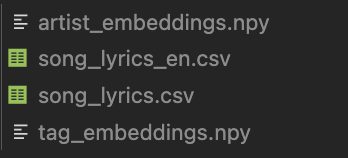

# TM_project

## setup

1. `conda create --name tm_project python=3.8`

1. `conda install --file requirements.txt` (update list: `conda list -e > requirements.txt`)

1. install song_lyrics.csv, save it under the dictionary 'data/'

1. run setup.ipynb (may not work: update list: `!pip freeze > pip_requirements.txt`)

1. run attribute_embeddings.ipynb.

1. run preprocessing.ipynb. At this time, you should see the 4 files below under `data/`:

## usage

1. Use `np.load('data/artist_embeddings.npy')` to load artist embeddings and tag embeddings

1. Use song_lyrics_en.csv whenever you want to use the dataset.

1. Use song_lyrics_en.csv ['song_document'] when you want to use the song document.
